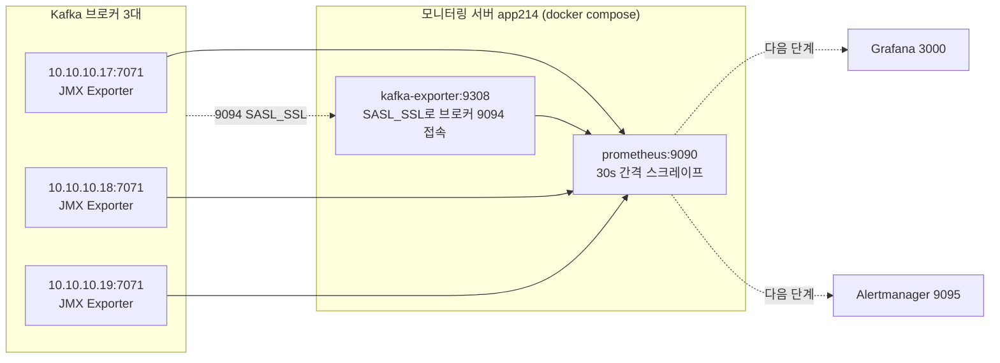

# Kafka 모니터링 수집 계층 구축 — JMX Exporter · kafka_exporter · Prometheus
- 날짜: 2026-09-09 / 브랜치: master @ dc664e2 / 관련: [kafka/concepts/14-monitoring-prometheus-grafana.md](../../kafka/concepts/14-monitoring-prometheus-grafana.md), [docs/kafka-port-map.md](../kafka-port-map.md)

## 결론
브로커 3대(JMX Exporter 7071) + kafka_exporter(9308)를 Prometheus(9090)가 수집하는 구성을 모니터링 서버 app214에 올렸고, 타깃 5개 전부 `up` 확인.

## 변경 파일
이 저장소의 변경은 없음. 아래는 **모니터링 서버 app214**의 파일이다 (compose 디렉터리: `~/kafka-exporter/`).

| 파일 (서버) | 변경 내용 | 이유 |
|---|---|---|
| `docker-compose.yml` | `kafka-exporter`(danielqsj/kafka-exporter) + `prometheus`(prom/prometheus:v2.54.1) 두 서비스 정의 | 두 컨테이너를 같은 compose 네트워크에 두어 Prometheus가 서비스명 `kafka-exporter:9308`로 접근 |
| `.env` | `KAFKA_EXPORTER_PASSWORD` | SASL 비밀번호를 compose 파일 밖으로 분리 |
| `certs/ca.crt` | 클러스터 CA 인증서 | kafka_exporter가 `--tls.ca-file`로 브로커 TLS 검증 |
| `prometheus/prometheus.yml` | job 3개: `kafka-broker`(3대 IP:7071), `kafka-exporter`, `prometheus` | 수집 대상 정의. `scrape_interval: 30s` |
| 브로커 3대 `KAFKA_OPTS` | `-javaagent:jmx_prometheus_javaagent.jar=7071:kafka-rules.yml` | 브로커 JMX 메트릭을 Prometheus 형식으로 노출 (이번 세션 이전에 완료) |

## 결정과 근거
- **scrape_interval 30s**: 브로커 3대 규모에서 15s와 차이 없고 저장량만 늘어남. JMX 스크레이프가 1.3s 걸리므로 timeout 10s에도 여유.
- **kafka_exporter와 Prometheus를 같은 compose에**: 서비스명으로 접근 가능해 IP 하드코딩을 줄임. 브로커는 다른 서버라 IP 직접 기재.
- **kafka_exporter 전용 SASL 계정(`kafka-exporter`)**: 서비스 계정 돌려쓰기 금지 원칙. describe 권한만 필요.
- **Prometheus 데이터는 named volume `prometheus-data`**: 컨테이너 재생성 시 시계열 유실 방지. 초안에는 빠져 있어서 추가함.
- **retention 30d**: 시작값. 용량 부담 작아 필요 시 늘림.
- **`--web.enable-lifecycle`**: 규칙/설정 변경 시 `curl -X POST :9090/-/reload`로 재시작 없이 반영.
- **relabel_configs·rule_files·alerting 블록은 넣지 않음**: 지금 단계에 불필요. Alertmanager 없이 `alerting` 블록을 넣으면 연결 실패 경고만 남음. 알람 단계에서 `rule_files` 두 줄 추가 예정.
- 버린 대안: kafka-exporter 이미지 `:latest` → 플래그 변경 위험으로 버전 고정 권고(`v1.8.0`). 사용자 최종 적용 여부 미확인.

## 검증
`curl -s http://localhost:9090/api/v1/targets` (2026-09-09 06:18 UTC 기준):

| 타깃 | health | lastError | 수집 시간 |
|---|---|---|---|
| 10.10.10.17:7071 | up | 없음 | 1.30s |
| 10.10.10.18:7071 | up | 없음 | 1.34s |
| 10.10.10.19:7071 | up | 없음 | 1.32s |
| kafka-exporter:9308 | up | 없음 | 0.07s |
| localhost:9090 | up | 없음 | 0.006s |

미검증:
- `/graph`에서 `kafka_controller_kafkacontroller_activecontrollercount`, `kafka_consumergroup_lag` 값 조회 (메트릭 이름이 JMX 규칙 파일에 따라 다를 수 있음)
- `docker compose ps`의 restart 정책 반영 여부

## 남은 것
- Grafana 추가: 같은 compose에 서비스 추가, 데이터소스 `http://prometheus:9090`, 대시보드 ID 7589(kafka_exporter) + Strimzi Kafka 대시보드(JMX) import
- Alertmanager 추가: `--web.listen-address=:9095` 필수 (9093은 KRaft 컨트롤러가 사용, [port-map](../kafka-port-map.md) 참고)
- `prometheus/rules/kafka.yml` 알람 규칙 작성 + `prometheus.yml`에 `rule_files` 추가 (컨트롤러 ≠1, URP>0 5m, OfflinePartitions>0, lag 증가 추세)
- 방화벽 신청: 9090(관리자 IP), 3000(개발자 대역 포함) — port-map 문서 기준
- JMX 규칙 파일 설정 내역은 이번 대화에 없음. 브로커 쪽 `kafka-rules.yml` 출처(예: 공식 `kafka-2_0_0.yml`) 확인해 이 문서에 보강 필요
